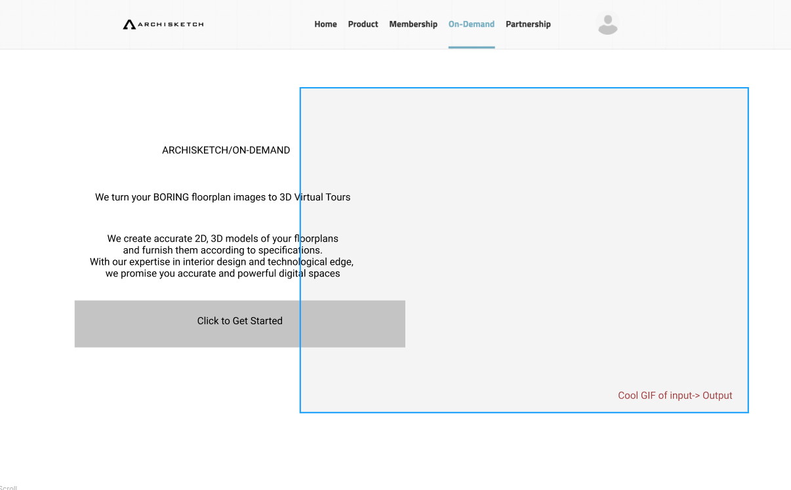

# Archisketch On-Demand Service(front-end)

> Archisketch On-Demand Service 프론트앤드 구축
> - 각자 제품 프로젝트 시작해보기
> - 요건 : 프로젝트를 하나의 템플릿으로 최대한 구축해보기
> 1. React / Django를 베이스로, 최대한 깔끔한 템플릿 File Structure로 구성하여 구축해보기
> 2. Sass/Scss를 가지고 SMACSS, BEM, OOCSS, Atomic 4가지 방법론을 혼용하여, 최대한 매끄러운 CSS Structure 구성해보기
> 3. 관리는 Github으로 소통 및 진행하기

### Environment / Install
------

Ubuntu 18.0.4
Python 3.6
Node.js 12.14.0
npm 6.13.4

<code> npm install -g </code>
<code> npm install --save react-router-dom </code>
<code> npm install -g node-sass </code>

### Update
------

- 0.1
  - landing page layout
- 0.2
  - linking landing page & step 0
- 0.3
  - All page frame update / Milestone update 
- 0.4
  - add page contents / build data structure
- 0.5
  - clean file structure / main page decorating

### Milestones
------
 -  [ ] due date : 1/31
 -  [ ] Page layout
     -  [x] step page layout 완성 [1] *2020.01.14*
     -  [ ] page contents 제작
         -  [ ] Landing page GIF [3]
         -  [ ] Step 0 GIF [3]
         -  [ ] Progress bar [3]
         -  [x] Interior imgae data set(+ tagging) [1] *2020.01.14*
-  [ ] Functions
   -  [ ] Step별 data에 따른 output 설정
      -  [x] data container [1] *2020.01.13*
      -  [ ] step 2 format alert  / drag & drop[1]
         -  [x] drag & drop *2020.01.14*
         -  [ ] backend server 구축
      -  [ ] step 3 image output [1]
      -  [x] step 5(summary & user info 받아오기) [1] *2020.01.14*
   -  [ ] Payment [3]
-  [ ] Design
   -  [ ] Page transition effects [2]
   -  [x] Button effects [2]  *2020.01.15*
   -  [ ] Progress bar [2]
   -  [ ] Colors [2]
-  [x] Structure
   -  [x] Scss 모듈화 / 정리 [2] *2020.01.15*
   -  [x] Components 모듈화 / 정리 [2] *2020.01.15*

