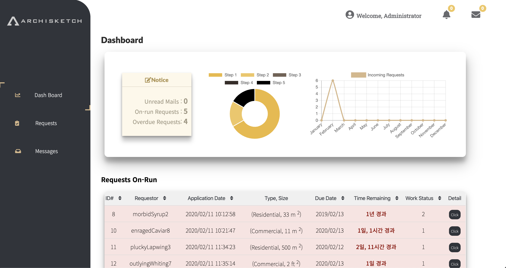

# Archisketch On-Demand Service

> Archisketch On-Demand Service 구축

**User는 쉽고 간편한, Admin은 관리하기 편리한 On-Demand Service**

##### User page

##### Admin page

## Installation (OS X, Linux)

- User page (React)

  <code>$ npm install </code>

  > If "node_modules"  is already installed, you should run these commands first.
  >
  > <code>$ npm cache clean --force</code>
  >
  > <code>$ rm -rf node_modules</code> 

- Admin page (Django, python 3.6)

  <code>$ cd Admin </code>

  <code>$ pip install -r requirements.txt </code>

  <code>$ python manage.py migrate </code>

- Run server

  <code>$ npm start</code>

  <code>$ python manage.py runserver</code>
  
- 메일 계정
  json file이 있어야 하므로 contributors 에게 요청하기.

## Manual

####  User

1. Click to Get Stared! button 을 클릭한다.
2. Tutorial을 통해 ondemand 서비스의 작동과정을 파악한다.
3. 각 progress 마다 user의 정보를 입력 / 선택한다.
4. 결제를 한다.
5. Email을 통해 결과물을 받고, 피드백한다.

#### Admin

1. Dashboard

- 전체 request에 대한 정보를 파악할 수 있으며, 완료되지 않은 request list를 볼 수 있다.

2. Request

- 완료되지 않은 request list와 total request list를 확인할 수 있다.
- 각 request의 user가 이메일로 피드백을 보낼경우, request의 글자가 굵어지며 Detail button을 눌러 확인할 수 있다.
- Due date가 지난 request의 경우 붉은색으로 표시된다.

3. Detail / Edit

- Request의 상세정보를 파악할 수 있는 페이지로, detail button을 눌러 볼 수 있다.
- 각 Request의 user가 보낸 피드백을 한눈에 파악할 수 있으며, messenger 창을 통해 메일을 보낼 수 있다.
- Edit 페이지를 통해 request에 대한 정보를 수정할 수 있다.

4. Messages

- User가 보낸 피드백 및 메일을 한눈에 파악할 수 있다.

## Contributors

- Lee Jaeeun (Seoul National University)
- Kim Taeyeong (DGIST)

